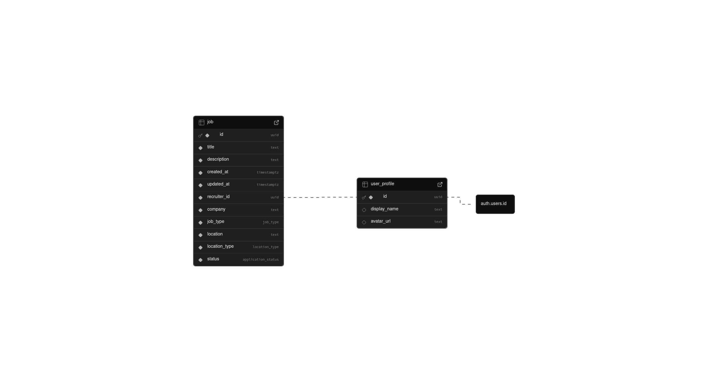
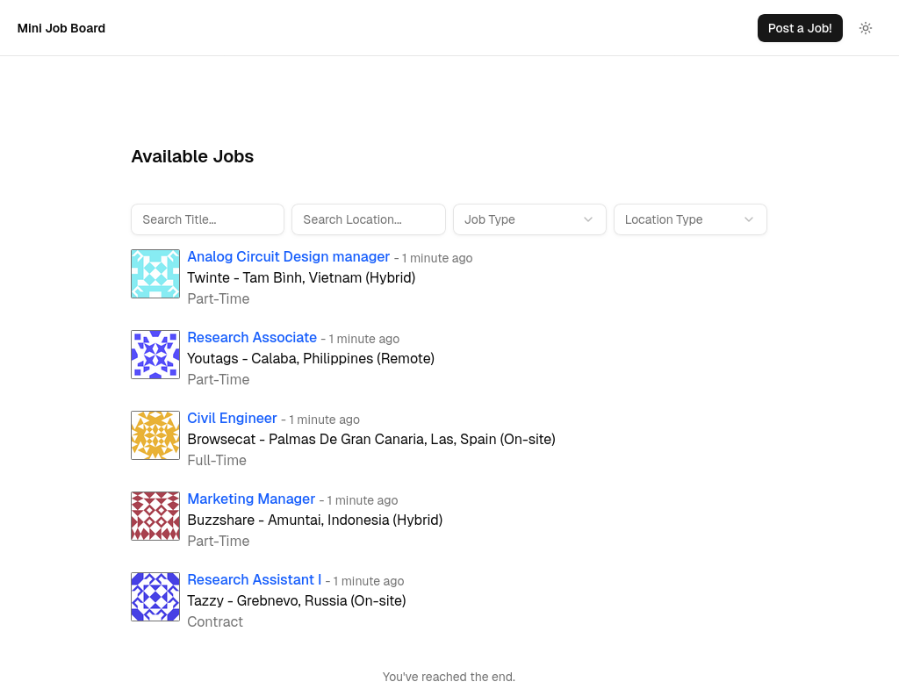
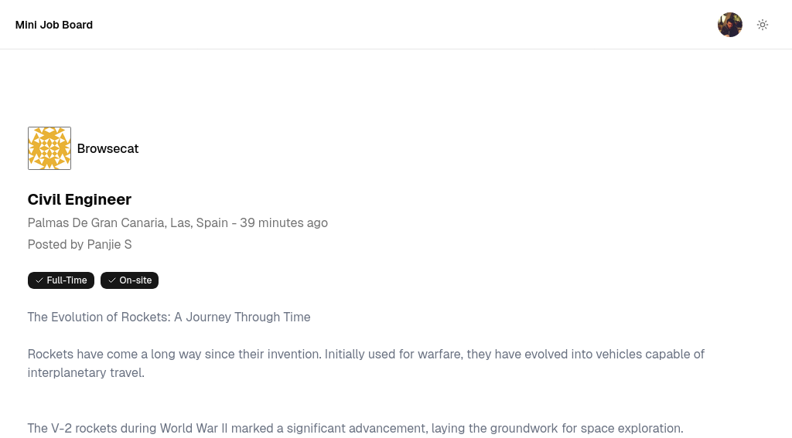
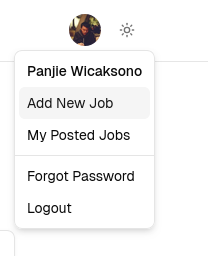
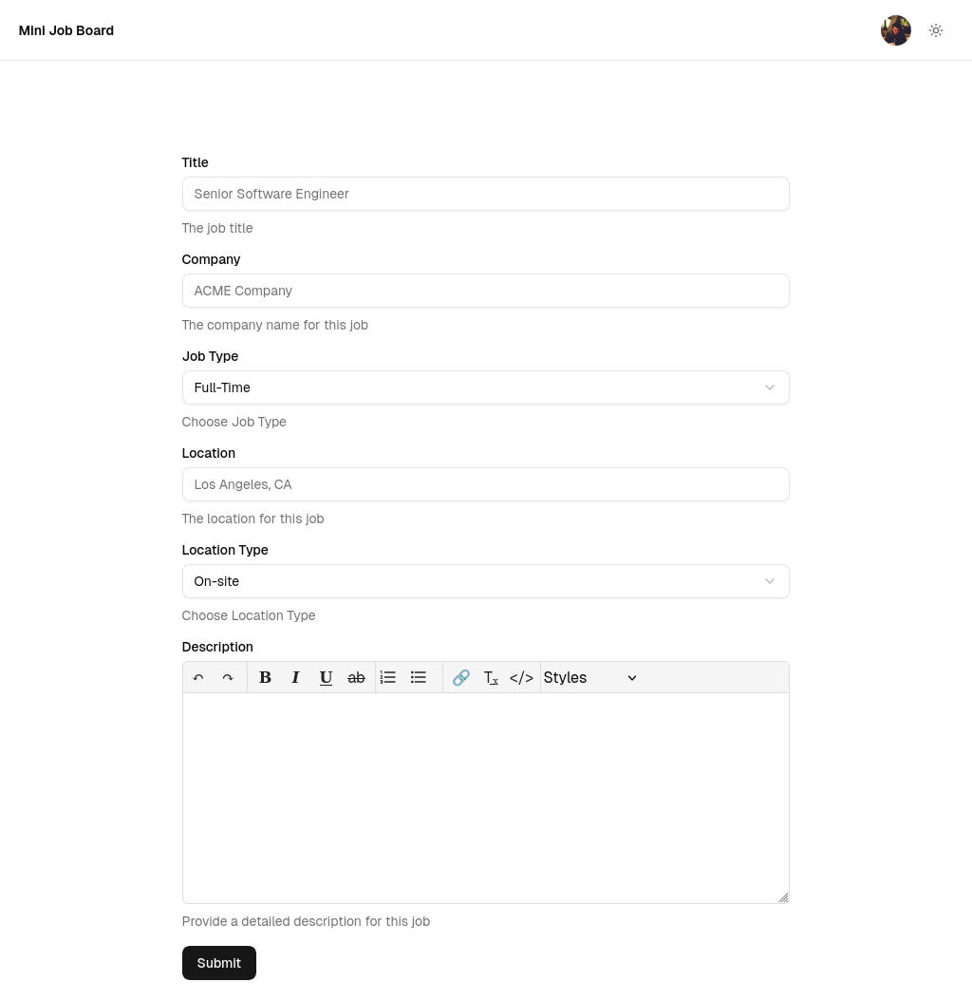
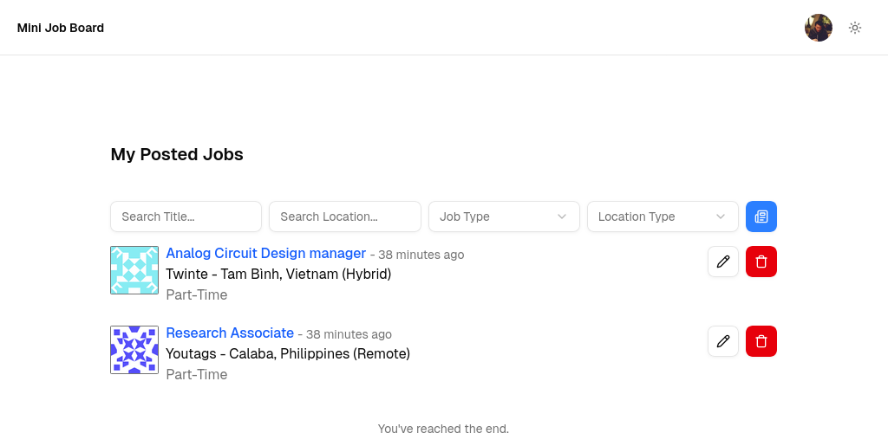
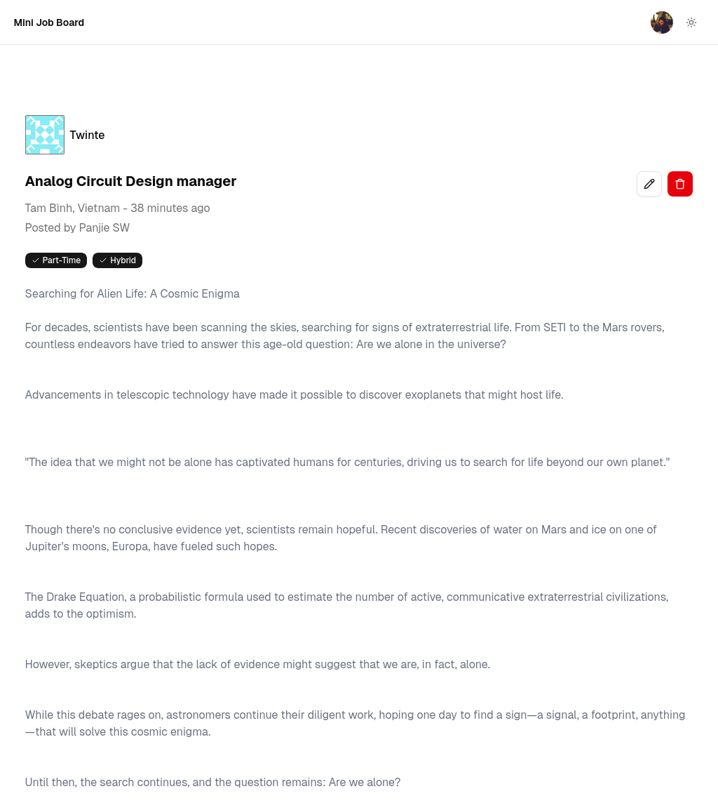

# Mini Job Board <!-- omit in toc -->

> A playground of Next.js + TailwindCSS + Supabase stack in the form of Job Board

[Live Site](https://mini-job-board-kappa.vercel.app/)

- [Approach and Architecture](#approach-and-architecture)
  - [PostgreSQL Tables Structure](#postgresql-tables-structure)
  - [Project Structure](#project-structure)
- [Requirements](#requirements)
- [Local Development](#local-development)
- [Vercel Deployment](#vercel-deployment)
- [Features](#features)
- [Potential Improvements](#potential-improvements)

## Approach and Architecture

### PostgreSQL Tables Structure



A simple tables structure which is enough to cover this use case

- `job` table contains Job Post data
- `user_profile` table contains a slice of Supabase Auth's user data
  - This table's data is generated automatically using Trigger and Function whenever there is a new user signed-up.
  - The goal is so we can do `join` operation to get a job's recruiter profile.

Structure was created inside Supabase console and later schema was dumped using `supabase db dump` command

### Project Structure

```text
.
├── app
│   ├── auth
│   ├── job
│   └── jobs
├── components
│   └── ui
├── components.json
├── hooks
├── lib
│   └── supabase
├── public
├── README.md
├── scripts
├── supabase
└── tsconfig.json
```

- Project was generated using `create-next-app`, then initialized with `shadcn` starter.
- For quick integration with `Supabase`, the [Supabase UI Library](https://supabase.com/ui) is used by generating codes through `shadcn`
  - [Password-Based Auth components](https://supabase.com/ui/docs/nextjs/password-based-auth)
    - Generates auth components, pages, and API routes (`login`, `signup`, `forgot-password`, etc)
    - Customized as needed
  - [Infinite Query Hook](https://supabase.com/ui/docs/infinite-query-hook)
    - For displaying Job Listing with auto pagination by scrolling
- [Gravatar](https://gravatar.com/) is used to display pictures for user's and company's avatar from email / company name.

## Requirements

- Node.js LTS
- Supabase Project
- (Optional) Vercel Account for deployment

## Local Development

Create Supabase project and run the `scripts/supa.sql` SQL script in Table Editor.

Create an `.env.local` file in the root and fill it with Supabase detail

```dotenv
# Update these with your Supabase details from your project settings > API
# https://app.supabase.com/project/_/settings/api
NEXT_PUBLIC_SUPABASE_URL=your-project-url
NEXT_PUBLIC_SUPABASE_PUBLISHABLE_OR_ANON_KEY=your-anon-key
```

Install project dependencies

```bash
$ npm install
```

Run local development server

```bash
$ npm run dev
```

## Vercel Deployment

Put the project in your own GitHub repository.

Create Vercel Account if you don't have one yet, and connect the GitHub repository in a new project. When asked for environment variables, create the same ones as provided in `.env.local` file.

Wait for deployment to complete.

Visit your `Supabase Console -> Authentication -> URL Configuration` and add the Vercel URL to `Redirect URLs` and also set it as `Site URL`.

## Features



Job Listing available publicly and able to filter by

- Title
- Location
- Type (Full-Time, Part-Time, Contract)
- Location Type (Remote, Hybrid, On-site)



Job Detail



Job Poster authentication through Supabase Auth



New Job Posting for authenticated users



Job Poster Dashboard showing own posted jobs management



Job Detail for Job Poster's owner management

## Potential Improvements

What I would improve if given more time

- Project and Development
  - Complete unit tests and integration / e2e tests
  - Integrate Storybook for easier design system development
  - CI/CD improvements
    - Preview branch for Vercel and Storybook integrated with Pull Requests
    - GitHub action to run tests in the main branch as well as Pull Requests
- Features
  - Apply to listed Job
    - Separate users into Recruiter and Employee
    - Dashboard for Employee to track their application
    - Shows submitted applications in Recruiter Dashboard
  - Enhanced profile customization
